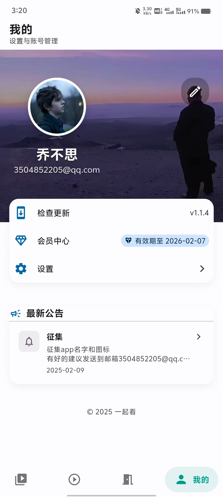
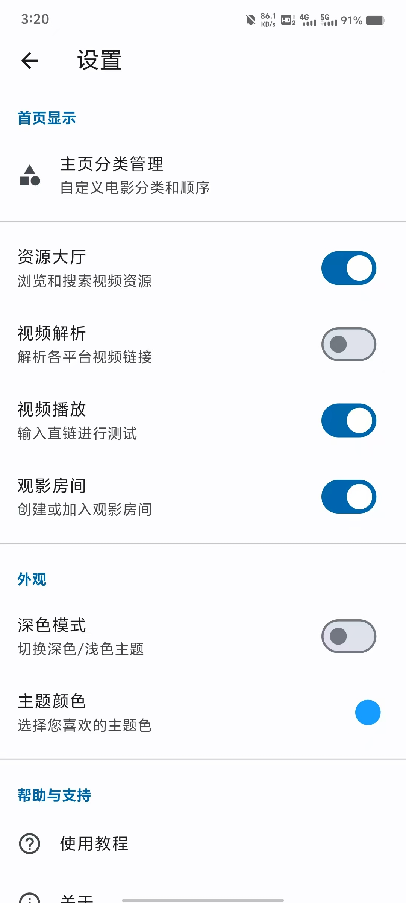

# 一起看

一起看是一个让用户能够同步观看视频的社交应用，支持实时聊天、视频同步播放等功能，让异地朋友也能一起享受观影的乐趣。

## ✨ 主要功能

- 🎥 **视频同步播放**：支持多人实时同步观看视频
- 💬 **实时聊天**：观影过程中可以实时交流讨论
- 🔄 **全网资源**：打通全网资源，支持全网视频播放
- 📱 **跨平台支持**：支持 Android 和 iOS 设备
- 🎨 **Material Design 3**：采用最新的 Material You 设计语言
- 🌙 **深色模式**：支持浅色/深色主题切换

## 📱 应用截图

<table>
  <tr>
    <td>

</td>
    <td>

</td>
    <td>

</td>
    <td>

</td>
    
  </tr>
</table>

<table>
  <tr>
    <td>

</td>
    <td>

</td>
    <td>

</td>
    <td>

</td>
  </tr>
</table>

## 🚀 开始使用

### 📥 下载安装

| 平台 | 状态 | 下载方式 |
|------|------|----------|
| Android | ✅ 已发布 | [直接下载](https://www.123684.com/s/5lHyTd-fyOHv)  |
| iOS | ⏳ 开发中 | 即将上线 |

### 使用方法

1. 搜索想要观看的视频
2. 创建或加入房间
3. 邀请好友加入
4. 开始一起观看！

## 🤝 参与贡献

欢迎进群贡献

## 👥 联系我们

- QQ群：679961545
